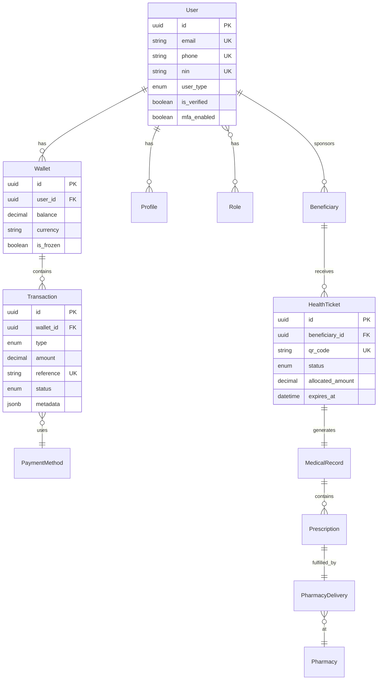

# 🏗️ ARCHITECTURE KALPÉ SANTÉ - Documentation Technique

## 📋 Table des Matières
1. [Vue d'Ensemble](#vue-densemble)
2. [Architecture Système](#architecture-système)
3. [Sécurité & Conformité](#sécurité--conformité)
4. [Modèle de Données](#modèle-de-données)
5. [Plan de Développement](#plan-de-développement)
6. [Standards & Best Practices](#standards--best-practices)

---

## 🎯 Vue d'Ensemble

### Vision Technique
Plateforme de santé digitale **hautement sécurisée**, **scalable** et **conforme** aux normes internationales (RGPD, HIPAA, ISO 27001) permettant le financement solidaire des soins de santé.

### Principes Architecturaux
```python
CORE_PRINCIPLES = {
    "security_first": "Zero-Trust Architecture, encryption E2E",
    "data_sovereignty": "Conformité RGPD + Loi sénégalaise données personnelles",
    "audit_trail": "Traçabilité complète immuable de toutes transactions",
    "high_availability": "99.9% uptime, disaster recovery",
    "performance": "P95 latency <200ms, optimisations DB",
    "clean_code": "SOLID, DDD, TDD, documentation exhaustive"
}
```

---

## 🏛️ Architecture Système

### Stack Technique (Production-Ready)

```yaml
Backend:
  framework: "Django 5.0+ / Django REST Framework 3.14+"
  language: "Python 3.11+"
  api_standard: "REST + OpenAPI 3.0"
  
Database:
  primary: "PostgreSQL 15+ (ACID, transactions robustes)"
  cache: "Redis 7+ (sessions, rate limiting)"
  search: "Elasticsearch 8+ (logs, analytics) [Phase 2]"
  
Async Processing:
  task_queue: "Celery 5+"
  message_broker: "RabbitMQ / Redis"
  
Security:
  authentication: "JWT (djangorestframework-simplejwt)"
  encryption: "AES-256, RSA-2048, TLS 1.3"
  secrets_management: "django-environ, AWS Secrets Manager"
  
Monitoring:
  apm: "Sentry (errors)"
  metrics: "Prometheus + Grafana"
  logging: "Structured JSON logs (python-json-logger)"
  
Testing:
  framework: "pytest + pytest-django"
  coverage: ">85% obligatoire"
  load_testing: "Locust / K6"
```

### Architecture Modulaire (Domain-Driven Design)

```
kalpe-sante-django/
├── config/                      # Configuration Django
│   ├── settings/
│   │   ├── base.py             # Settings communs
│   │   ├── development.py      # Dev local
│   │   ├── staging.py          # Pré-production
│   │   └── production.py       # Production sécurisée
│   ├── urls.py                 # URL root
│   ├── wsgi.py                 # WSGI application
│   └── asgi.py                 # ASGI (websockets futur)
│
├── apps/
│   ├── core/                   # 🔧 Fondations transverses
│   │   ├── models.py           # BaseModel, TimestampedModel
│   │   ├── permissions.py      # Custom permissions
│   │   ├── exceptions.py       # Custom exceptions
│   │   ├── validators.py       # Validators réutilisables
│   │   ├── utils.py            # Helpers génériques
│   │   ├── middleware.py       # Request logging, audit
│   │   └── audit.py            # Audit trail système
│   │
│   ├── users/                  # 👤 Gestion utilisateurs multi-rôles
│   │   ├── models.py           # User, Profile, Role, Permission
│   │   ├── serializers.py      # UserSerializer, KYCSerializer
│   │   ├── views.py            # Auth, registration, MFA
│   │   ├── permissions.py      # RBAC custom
│   │   ├── managers.py         # UserManager custom
│   │   ├── signals.py          # Post-save audit, notifications
│   │   ├── tasks.py            # KYC async, email verification
│   │   └── tests/
│   │       ├── test_models.py
│   │       ├── test_auth.py
│   │       └── test_permissions.py
│   │
│   ├── wallet/                 # 💰 Portefeuille électronique
│   │   ├── models.py           # Wallet, Transaction, SolidaryFund
│   │   ├── serializers.py      # TransactionSerializer
│   │   ├── views.py            # Balance, transfer, history
│   │   ├── services.py         # Business logic isolation
│   │   ├── managers.py         # TransactionManager optimisé
│   │   ├── validators.py       # Fraud detection, limits
│   │   ├── signals.py          # Post-transaction notifications
│   │   ├── tasks.py            # Reconciliation, reporting
│   │   └── tests/
│   │
│   ├── healthcare/             # 🏥 Dossiers médicaux & consultations
│   │   ├── models.py           # Patient, MedicalRecord, Ticket, Prescription
│   │   ├── serializers.py      # HIPAA-compliant serialization
│   │   ├── views.py            # CRUD tickets, QR generation
│   │   ├── services.py         # Business rules santé
│   │   ├── encryption.py       # Données sensibles chiffrées
│   │   ├── signals.py          # Workflow automation
│   │   └── tests/
│   │
│   ├── pharmacy/               # 💊 Gestion pharmacie
│   │   ├── models.py           # Pharmacy, Drug, Stock, Delivery
│   │   ├── serializers.py      # StockSerializer
│   │   ├── views.py            # Ordonnances, stock, bordereaux
│   │   ├── services.py         # Traçabilité médicaments
│   │   └── tests/
│   │
│   ├── payments/               # 💳 Intégrations paiement
│   │   ├── models.py           # PaymentMethod, PaymentTransaction
│   │   ├── gateways/           # Connecteurs externes
│   │   │   ├── base.py         # Interface commune
│   │   │   ├── orange_money.py
│   │   │   ├── wave.py
│   │   │   └── stripe.py       # Cartes internationales
│   │   ├── webhooks.py         # Callbacks providers
│   │   ├── services.py         # Orchestration paiements
│   │   └── tests/
│   │
│   ├── analytics/              # 📊 Reporting & BI
│   │   ├── models.py           # Report, Dashboard, Metric
│   │   ├── views.py            # Dashboards multi-rôles
│   │   ├── aggregators.py      # Calculs métriques
│   │   ├── exporters.py        # PDF, Excel, CSV
│   │   └── tests/
│   │
│   ├── notifications/          # 📬 Notifications multi-canal
│   │   ├── models.py           # Notification, Template
│   │   ├── channels/           # SMS, Email, Push
│   │   │   ├── sms.py          # Twilio/AfricasTalking
│   │   │   ├── email.py        # SendGrid/SES
│   │   │   └── push.py         # FCM
│   │   ├── tasks.py            # Async sending
│   │   └── tests/
│   │
│   └── integrations/           # 🔌 APIs externes
│       ├── cmu/                # Connexion CMU
│       │   ├── client.py       # API client
│       │   ├── sync.py         # Synchronisation données
│       │   └── models.py       # Mapping CMU
│       ├── pharmacy_systems/   # Systèmes pharmaceutiques
│       └── tests/
│
├── shared/                     # Code partagé
│   ├── constants.py            # Constantes globales
│   ├── enums.py                # Enums typed
│   └── mixins.py               # Mixins réutilisables
│
├── scripts/                    # Scripts admin
│   ├── init_db.py             # Seed initial data
│   ├── migrate_cmu.py         # Import données CMU
│   └── backup.py              # Backup automation
│
├── docs/                       # Documentation
│   ├── ARCHITECTURE.md         # Ce fichier
│   ├── API.md                  # Documentation API
│   ├── DEPLOYMENT.md           # Guide déploiement
│   └── SECURITY.md             # Procédures sécurité
│
├── tests/                      # Tests d'intégration
│   ├── integration/
│   ├── e2e/
│   └── load/
│
├── logs/                       # Logs applicatifs
├── media/                      # Fichiers uploads (chiffrés)
├── static/                     # Fichiers statiques
├── requirements/
│   ├── base.txt               # Dépendances communes
│   ├── development.txt        # Dev tools
│   ├── production.txt         # Production optimisé
│   └── testing.txt            # Testing tools
│
├── .env.example               # Template variables env
├── .gitignore
├── pytest.ini                 # Config pytest
├── pyproject.toml             # Poetry/Ruff config
├── Dockerfile
├── docker-compose.yml
└── manage.py
```

---

## 🔐 Sécurité & Conformité

### 1. Architecture Zero-Trust

```python
SECURITY_LAYERS = {
    "authentication": {
        "mfa_required": ["admin", "healthcare_provider", "pharmacist"],
        "jwt_rotation": "15min access + 7d refresh",
        "session_management": "Redis-backed, secure cookies",
        "password_policy": "NIST SP 800-63B compliant"
    },
    
    "authorization": {
        "rbac_model": "Role-Based Access Control granulaire",
        "permission_levels": ["read", "write", "delete", "admin"],
        "object_level_permissions": "django-guardian",
        "audit_all_access": "Logs immutables"
    },
    
    "data_protection": {
        "encryption_at_rest": "AES-256 (PII, medical data)",
        "encryption_in_transit": "TLS 1.3 obligatoire",
        "field_level_encryption": "django-fernet-fields",
        "pii_masking": "Logs & exports anonymisés"
    },
    
    "network_security": {
        "waf": "Cloudflare / AWS WAF",
        "ddos_protection": "Rate limiting (django-ratelimit)",
        "ip_whitelisting": "Admin endpoints",
        "api_versioning": "Backward compatibility"
    }
}
```

### 2. Conformité Réglementaire

#### RGPD (EU) + Loi Sénégalaise
```python
GDPR_COMPLIANCE = {
    "consent_management": "Consentement explicite tracé",
    "right_to_access": "Export données personnelles",
    "right_to_erasure": "Anonymisation (pas suppression hard)",
    "data_portability": "Format JSON standard",
    "breach_notification": "72h max, procédure documentée",
    "dpo_designation": "Data Protection Officer nommé"
}
```

#### HIPAA (Health Data)
```python
HIPAA_COMPLIANCE = {
    "phi_protection": "Protected Health Information chiffrée",
    "access_controls": "Logs accès dossiers médicaux",
    "audit_controls": "Piste audit complète",
    "integrity_controls": "Checksums, versioning",
    "transmission_security": "TLS 1.3, VPN pour admin"
}
```

#### PCI DSS (Paiements)
```python
PCI_COMPLIANCE = {
    "no_card_storage": "Tokenization via Stripe/PaymentGateway",
    "network_segmentation": "Payment service isolé",
    "penetration_testing": "Trimestrial",
    "vulnerability_scanning": "Mensuel (OWASP ZAP)"
}
```

### 3. Audit Trail Immuable

```python
# Modèle d'audit (blockchain-inspired)
class AuditLog(models.Model):
    """
    Logs immuables pour conformité légale.
    Chaque action sensible est enregistrée avec hash chainé.
    """
    timestamp = models.DateTimeField(auto_now_add=True, db_index=True)
    user = models.ForeignKey('users.User', on_delete=models.PROTECT)
    action = models.CharField(max_length=100)  # CREATE, UPDATE, DELETE, ACCESS
    resource_type = models.CharField(max_length=50)  # Transaction, MedicalRecord
    resource_id = models.UUIDField()
    ip_address = models.GenericIPAddressField()
    user_agent = models.TextField()
    changes = models.JSONField()  # Diff avant/après
    previous_hash = models.CharField(max_length=64)
    current_hash = models.CharField(max_length=64, unique=True)
    
    class Meta:
        indexes = [
            models.Index(fields=['user', '-timestamp']),
            models.Index(fields=['resource_type', 'resource_id']),
        ]
```

---

## 💾 Modèle de Données

### Principes de Design
1. **Normalization**: 3NF minimum pour intégrité
2. **UUIDs**: Primary keys UUID4 (sécurité, distribution)
3. **Soft Deletes**: is_active flag (conformité RGPD)
4. **Timestamps**: created_at, updated_at automatiques
5. **Versioning**: Données critiques versionnées (django-simple-history)

### Schéma Entités Principales



### Modèles Core (BaseModel)

```python
# apps/core/models.py
import uuid
from django.db import models
from django.utils.translation import gettext_lazy as _

class TimestampedModel(models.Model):
    """
    Modèle abstrait pour timestamps automatiques.
    """
    created_at = models.DateTimeField(
        _('created at'),
        auto_now_add=True,
        db_index=True,
        help_text=_("Date de création automatique")
    )
    updated_at = models.DateTimeField(
        _('updated at'),
        auto_now=True,
        help_text=_("Date de dernière modification")
    )
    
    class Meta:
        abstract = True
        ordering = ['-created_at']


class SoftDeleteModel(models.Model):
    """
    Modèle abstrait pour soft deletes (RGPD compliant).
    """
    is_active = models.BooleanField(
        _('active'),
        default=True,
        db_index=True,
        help_text=_("Faux = suppression logique")
    )
    deleted_at = models.DateTimeField(
        _('deleted at'),
        null=True,
        blank=True
    )
    
    class Meta:
        abstract = True


class BaseModel(TimestampedModel, SoftDeleteModel):
    """
    Modèle de base combinant UUID PK, timestamps, soft delete.
    """
    id = models.UUIDField(
        primary_key=True,
        default=uuid.uuid4,
        editable=False,
        help_text=_("Identifiant unique UUID4")
    )
    
    class Meta:
        abstract = True
    
    def soft_delete(self):
        """Suppression logique."""
        from django.utils import timezone
        self.is_active = False
        self.deleted_at = timezone.now()
        self.save(update_fields=['is_active', 'deleted_at'])
```

---

## 📐 Plan de Développement

### Phase 1 - MVP (Mois 1-3)

#### Sprint 1-2: Fondations (2 semaines)
```python
SPRINT_1_2 = {
    "infrastructure": [
        "✅ Setup projet Django 5.0 + DRF",
        "✅ Configuration multi-env (dev/staging/prod)",
        "✅ PostgreSQL + Redis + Docker Compose",
        "✅ CI/CD pipeline (GitHub Actions)",
        "✅ Sentry + structured logging",
        "✅ Pre-commit hooks (black, isort, flake8, mypy)"
    ],
    "core_app": [
        "✅ BaseModel, TimestampedModel, SoftDeleteModel",
        "✅ Custom User model extensible",
        "✅ Middleware audit trail",
        "✅ Exception handling global",
        "✅ API versioning (/api/v1/)",
        "✅ OpenAPI schema (drf-spectacular)"
    ],
    "tests": [
        "✅ pytest configuration",
        "✅ Factory Boy setup",
        "✅ Coverage >85%"
    ]
}
```

#### Sprint 3-4: Authentication & Users (2 semaines)
```python
SPRINT_3_4 = {
    "features": [
        "✅ JWT auth (access + refresh tokens)",
        "✅ User registration avec email verification",
        "✅ Multi-role system (Beneficiary, Sponsor, Provider...)",
        "✅ Profile management",
        "✅ Password reset sécurisé",
        "✅ MFA (TOTP) pour rôles sensibles"
    ],
    "security": [
        "✅ Rate limiting endpoints auth",
        "✅ CORS configuration",
        "✅ Password strength validation",
        "✅ Session management Redis"
    ]
}
```

#### Sprint 5-6: Wallet Core (2 semaines)
```python
SPRINT_5_6 = {
    "features": [
        "✅ Wallet creation automatique",
        "✅ Transaction model (ACID compliant)",
        "✅ Transfer diaspora → bénéficiaire",
        "✅ Balance management thread-safe",
        "✅ Transaction history avec pagination",
        "✅ Transaction status workflow"
    ],
    "business_logic": [
        "✅ Validation montants & limites",
        "✅ Fraud detection basique",
        "✅ Reconciliation quotidienne (Celery task)",
        "✅ Notifications post-transaction"
    ]
}
```

#### Sprint 7-8: Health Tickets MVP (2 semaines)
```python
SPRINT_7_8 = {
    "features": [
        "✅ Création tickets santé",
        "✅ QR code generation sécurisé",
        "✅ Validation ticket par établissement",
        "✅ Workflow statuses (created → validated → used → closed)",
        "✅ Expiration automatique tickets"
    ],
    "integration": [
        "✅ Link ticket → wallet transaction",
        "✅ Notifications multi-acteurs",
        "✅ Admin dashboard tickets"
    ]
}
```

#### Sprint 9-10: Testing & Stabilisation (2 semaines)
```python
SPRINT_9_10 = {
    "qa": [
        "✅ Tests end-to-end flux complet",
        "✅ Load testing (1000 req/min)",
        "✅ Security audit (OWASP Top 10)",
        "✅ Penetration testing",
        "✅ Documentation API complète"
    ],
    "optimization": [
        "✅ Query optimization (select_related, prefetch)",
        "✅ Caching strategy Redis",
        "✅ Index database critique",
        "✅ Monitoring alerts setup"
    ]
}
```

### Phase 2 - Scale (Mois 4-8)

#### Fonctionnalités Majeures
```python
PHASE_2_FEATURES = {
    "integrations": [
        "🚀 API CMU (authentification, sync patients)",
        "🚀 Orange Money / Wave webhooks",
        "🚀 Stripe cartes internationales",
        "🚀 Systèmes pharmaceutiques (stock sync)"
    ],
    
    "pharmacy_module": [
        "🚀 Gestion stock temps réel",
        "🚀 Ordonnances numériques",
        "🚀 Bordereaux remboursement automatisés",
        "🚀 Traçabilité médicaments (batch, expiration)"
    ],
    
    "analytics": [
        "🚀 Dashboards multi-rôles",
        "🚀 Reports exports (PDF, Excel)",
        "🚀 Métriques business temps réel",
        "🚀 Fraud detection ML basique"
    ],
    
    "advanced_security": [
        "🚀 Field-level encryption données médicales",
        "🚀 Audit trail blockchain-inspired",
        "🚀 GDPR compliance tools (export, erasure)",
        "🚀 Penetration testing continu"
    ]
}
```

### Phase 3 - Ecosystem (Mois 9-18)

```python
PHASE_3_FEATURES = {
    "platform": [
        "🌍 API publique documentée",
        "🌍 Webhooks pour partenaires",
        "🌍 Marketplace services santé",
        "🌍 Multi-tenant pour mutuelles"
    ],
    
    "ai_ml": [
        "🌍 Scoring vulnérabilité patients",
        "🌍 Prédiction besoins financement",
        "🌍 Détection anomalies avancée",
        "🌍 Chatbot support multilingue"
    ],
    
    "scale": [
        "🌍 Microservices extraction progressive",
        "🌍 Event-driven architecture (Kafka)",
        "🌍 Multi-region deployment",
        "🌍 99.99% SLA guarantee"
    ]
}
```

---

## 🎯 Standards & Best Practices

### 1. Code Quality Standards

```python
CODE_STANDARDS = {
    "style_guide": "PEP 8 + Black formatter",
    "type_hints": "Mypy strict mode",
    "docstrings": "Google style docstrings",
    "complexity": "McCabe <10 par fonction",
    "line_length": "88 caractères (Black default)",
    "imports": "isort avec profil black"
}

# Pre-commit hooks obligatoires
PRE_COMMIT_HOOKS = [
    "black",           # Formatting
    "isort",           # Import sorting
    "flake8",          # Linting
    "mypy",            # Type checking
    "bandit",          # Security linting
    "safety",          # Dependency vulnerabilities
    "pytest",          # Tests avant commit
]
```

### 2. Testing Strategy

```python
TESTING_PYRAMID = {
    "unit_tests": {
        "coverage": ">85%",
        "framework": "pytest + pytest-django",
        "fixtures": "Factory Boy pour données test",
        "mocking": "pytest-mock, responses"
    },
    
    "integration_tests": {
        "scope": "Flux multi-apps (wallet + notifications)",
        "database": "PostgreSQL test isolée",
        "external_apis": "Mocked (vcr.py)"
    },
    
    "e2e_tests": {
        "framework": "Playwright / Selenium",
        "scenarios": "User journeys critiques",
        "frequency": "Avant chaque release"
    },
    
    "performance_tests": {
        "tool": "Locust / K6",
        "targets": [
            "1000 req/min soutenu",
            "P95 latency <200ms",
            "Zero erreur sous charge"
        ]
    },
    
    "security_tests": {
        "sast": "Bandit",
        "dast": "OWASP ZAP",
        "dependency_scan": "Safety, Snyk",
        "frequency": "CI/CD automatique"
    }
}
```

### 3. Git Workflow

```bash
# Branching strategy: GitFlow adapté
main              # Production stable
├── develop       # Intégration continue
├── feature/*     # Nouvelles fonctionnalités
├── hotfix/*      # Corrections urgentes prod
└── release/*     # Préparation releases

# Commit messages: Conventional Commits
feat(wallet): add transaction reconciliation task
fix(auth): resolve JWT refresh token expiration
docs(api): update OpenAPI schema for payments
test(healthcare): add ticket validation scenarios
refactor(core): optimize audit log queries
perf(wallet): add database indexes for transactions
security(users): implement rate limiting on login
```

### 4. Code Review Checklist

```python
CODE_REVIEW_CHECKLIST = {
    "functionality": [
        "☐ Code résout le problème décrit",
        "☐ Edge cases gérés",
        "☐ Pas de régression introduite"
    ],
    
    "security": [
        "☐ Pas de données sensibles hardcodées",
        "☐ Validation inputs utilisateur",
        "☐ Permissions vérifiées",
        "☐ SQL injection impossible",
        "☐ XSS/CSRF protections actives"
    ],
    
    "performance": [
        "☐ Pas de N+1 queries",
        "☐ Indexes DB appropriés",
        "☐ Caching considéré si pertinent",
        "☐ Pagination pour listes longues"
    ],
    
    "tests": [
        "☐ Tests unitaires présents",
        "☐ Coverage >85% maintenu",
        "☐ Tests négatifs inclus",
        "☐ Fixtures réutilisables"
    ],
    
    "documentation": [
        "☐ Docstrings à jour",
        "☐ README mis à jour si nécessaire",
        "☐ API schema généré",
        "☐ CHANGELOG updated"
    ]
}
```

### 5. Performance Optimization

```python
PERFORMANCE_BEST_PRACTICES = {
    "database": {
        "orm_optimization": [
            "select_related() pour ForeignKey",
            "prefetch_related() pour Many-to-Many",
            "only() / defer() pour champs larges",
            "Indexes sur colonnes WHERE/ORDER BY fréquentes"
        ],
        
        "connection_pooling": "pgbouncer en production",
        
        "query_monitoring": "django-debug-toolbar (dev), Sentry (prod)"
    },
    
    "caching": {
        "strategy": "Cache-aside pattern",
        "layers": [
            "Redis: sessions, rate limiting",
            "Django cache: queryset results",
            "CDN: static/media files"
        ],
        "ttl": "Configurable par type de données"
    },
    
    "api": {
        "pagination": "Cursor-based pour grandes tables",
        "throttling": "Rate limiting par user/IP",
        "compression": "gzip responses >1KB",
        "async_tasks": "Celery pour opérations lourdes"
    }
}
```

---

## 🚀 Déploiement & Infrastructure

### Architecture Cloud (Production)

```yaml
cloud_provider: "AWS / Azure (région Sénégal/France)"

compute:
  application: "ECS Fargate / Kubernetes"
  workers: "Celery workers auto-scaling"
  
database:
  primary: "RDS PostgreSQL Multi-AZ"
  replicas: "2 read replicas"
  backup: "Daily automated + PITR"
  
cache:
  redis: "ElastiCache cluster mode"
  
storage:
  media: "S3 bucket encrypted"
  backups: "Glacier pour archives"
  
networking:
  load_balancer: "ALB avec WAF"
  cdn: "CloudFront / Cloudflare"
  vpc: "Isolated VPC, private subnets"
  
monitoring:
  logs: "CloudWatch / ELK stack"
  metrics: "Prometheus + Grafana"
  apm: "Sentry, New Relic"
  uptime: "Pingdom, UptimeRobot"
  
security:
  secrets: "AWS Secrets Manager"
  certificates: "ACM (auto-renewal)"
  encryption: "KMS pour données sensibles"
```

### CI/CD Pipeline

```yaml
# .github/workflows/ci-cd.yml structure
stages:
  - lint:
      - black --check
      - isort --check
      - flake8
      - mypy
      - bandit
  
  - test:
      - pytest --cov=apps --cov-report=xml
      - coverage threshold: 85%
  
  - security:
      - safety check
      - OWASP dependency check
  
  - build:
      - Docker image build
      - Tag with commit SHA
  
  - deploy_staging:
      - ECS deployment
      - Run migrations
      - Smoke tests
  
  - deploy_production:
      - Manual approval required
      - Blue-green deployment
      - Health checks
      - Rollback automatique si échec
```

---

## 📚 Documentation Requise

```python
DOCUMENTATION_DELIVERABLES = {
    "technique": [
        "✅ ARCHITECTURE.md (ce document)",
        "📝 API.md (OpenAPI interactive)",
        "📝 DEPLOYMENT.md (runbooks)",
        "📝 SECURITY.md (procédures sécurité)",
        "📝 DATABASE.md (schéma, migrations)"
    ],
    
    "utilisateur": [
        "📝 Guide utilisateur par rôle",
        "📝 FAQ multilingue",
        "📝 Vidéos tutoriels"
    ],
    
    "conformité": [
        "📝 RGPD compliance documentation",
        "📝 HIPAA compliance checklist",
        "📝 Audit reports",
        "📝 Incident response plan"
    ]
}
```

---

## 🎖️ Critères de Validation Jury

### Ingénierie Logicielle
- ✅ **Architecture**: Clean Architecture, Domain-Driven Design
- ✅ **Code Quality**: SOLID principles, Design Patterns appropriés
- ✅ **Testing**: Coverage >85%, TDD appliqué
- ✅ **Performance**: Optimisations DB, caching, async processing
- ✅ **Scalabilité**: Stateless, horizontal scaling ready
- ✅ **Documentation**: Technique complète, API interactive

### Sécurité
- ✅ **Authentication**: JWT, MFA, session management robuste
- ✅ **Authorization**: RBAC granulaire, object-level permissions
- ✅ **Encryption**: E2E pour données sensibles, TLS 1.3
- ✅ **Audit**: Logs immuables, traçabilité complète
- ✅ **Compliance**: RGPD, HIPAA, PCI DSS
- ✅ **Testing**: SAST, DAST, penetration testing

### Domaine Santé
- ✅ **Conformité**: HIPAA healthcare data protection
- ✅ **Interopérabilité**: Standards HL7/FHIR considérés
- ✅ **Traçabilité**: Médicaments, ordonnances, consultations
- ✅ **Privacy**: Données médicales chiffrées, accès audités
- ✅ **Disponibilité**: 99.9% uptime, disaster recovery
- ✅ **Intégrité**: Données critiques versionnées, immuables

---

## 📞 Contact & Gouvernance

```python
PROJECT_GOVERNANCE = {
    "tech_lead": "Architecture & code reviews",
    "security_officer": "Audits sécurité, conformité",
    "dpo": "RGPD compliance",
    "devops": "Infrastructure, CI/CD",
    "qa_lead": "Testing strategy, automation"
}

COMMUNICATION_CHANNELS = {
    "daily": "Standup 15min",
    "sprint_review": "Demo toutes les 2 semaines",
    "retrospective": "Amélioration continue",
    "architecture_review": "Décisions majeures documentées"
}
```

---

**Version**: 1.0  
**Date**: 2025-11-12  
**Status**: 🟢 Actif  
**Prochaine révision**: Après MVP delivery

---

*Ce document est vivant et sera mis à jour régulièrement pour refléter les évolutions du projet.*

